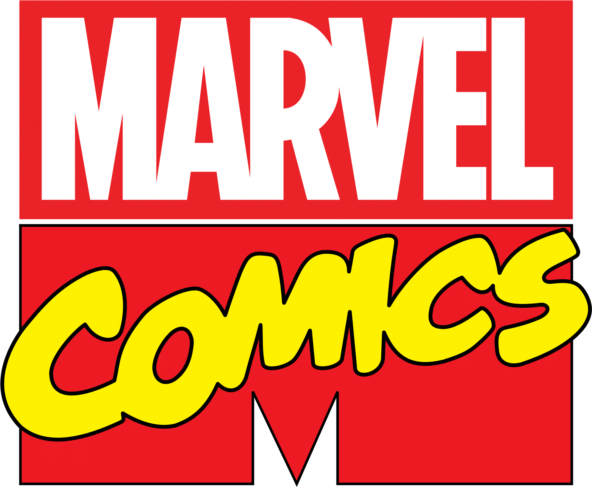
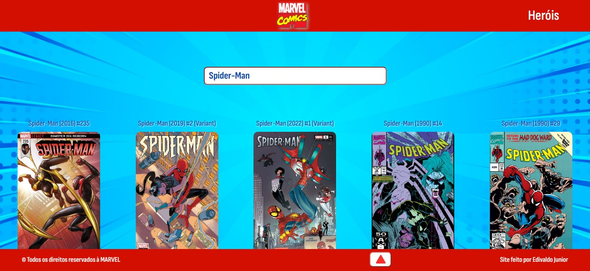

  

<h2>Consulta Quadrinhos (Comics)</h2>

Projeto Front-End com o objetivo de listar com detalhes todos as comics lançadas pela <strong>Editora Marvel</strong> até o momento, também tem uma página dedicada à todos os herois, listadas em ordem alfabética.

<h3>Tecnologias Utilizadas</h3>

-  [React](https://reactjs.org/) – Javascript UI Libraries
-  [JavaScript](https://developer.mozilla.org/en-US/docs/Web/JavaScript) – Languages
-  [Netlify](https://www.netlify.com/) – Static Web Hosting
-  [PostCSS](https://github.com/postcss/postcss) – CSS Pre-processors / Extensions
-  [React Router](https://github.com/rackt/react-router) – JavaScript Framework Components
-  [axios](https://github.com/mzabriskie/axios) – Javascript Utilities & Libraries

Para ver todas as tecnologias [clique aqui](/techstack.md)

<h3>Status do Projeto</h3>

<h3>Tempo dedicado ao projeto</h3>

  

